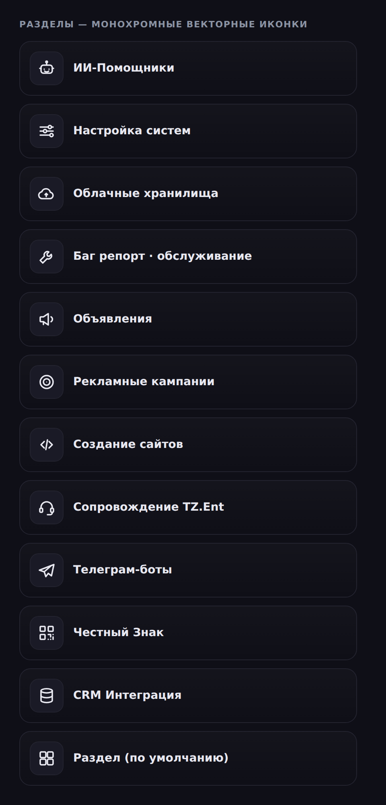

# TZ.Connect — четыре исправления: иконки, редактор Вики, комментарии задач, группировка чата

*Explainer к PR с четырьмя независимыми правками в `apps/web`. Каждая живёт в своём
файле, поэтому их можно ревьюить по отдельности. Миграции БД не требуются.*

| # | Область | Файл(ы) |
|---|---|---|
| 1 | ЧБ-иконки разделов | `connect/BlockIcons.tsx` (новый), `connect/SectionsPanel.tsx` |
| 2 | Полноценный редактор Вики | `connect/WikiPanel.tsx` |
| 3 | Читаемость комментариев задач | `connect/TasksPanel.tsx` |
| 4 | Группировка сообщений в чате | `connect/MessageArea.tsx` |

---

## Background

### Для тех, кто видит проект впервые

TZ.Connect — «Discord-подобный» раздел приложения (`apps/web`, Next.js + React).
Слева вертикальная рельса разделов, рядом список каналов/разделов, справа — область
сообщений. Тема оформляется CSS-переменными (`--cn-text`, `--cn-border`, `--cn-hover`
и т.п.), и есть чёрно-белые темы («Mono», «Mono Lite»), к которым проект постепенно
приводит весь интерфейс (недавний коммит «единые монохромные иконки вместо эмодзи»).

### Узкий контекст

Каждая из четырёх правок — точечная:

- **Разделы** главной группы показывались цветными глянцевыми **PNG**-иконками
  (`public/icons/block-*.png`). Это выбивалось из ЧБ-темы, а растр «тяжелее» вектора.
- **База знаний (Вики)** хранит статьи в Markdown, но рендерила их как **обычный
  текст** (`whitespace-pre-wrap`), поэтому никакое форматирование — включая размеры
  шрифта через заголовки — не отображалось, а редактор был «голой» `textarea`.
- **Комментарии к задаче** вводились в `textarea` фиксированной высоты (4 строки), а
  превью описания на карточке было мелким и малоконтрастным.
- **Сообщения** в чате группируются по автору; раньше группа рвалась 5-минутным
  таймером, дробя переписку одного человека на множество блоков с повторными аватарами.

---

## Intuition

**#1 — вектор вместо растра.** Вместо 11 цветных PNG вводится один компонент с
контурными SVG-иконками (`stroke="currentColor"`). Раз цвет наследуется от текста —
иконка автоматически чёрно-белая и совпадает с темой. Сопоставление по названию
раздела осталось прежним (ключевые слова → ключ иконки), поэтому «ИИ-Помощники»
по-прежнему получают робота, «Облачные хранилища» — облако и т.д.

**#2 — Markdown реально рендерится.** Ключ к «разному размеру шрифта» уже был в
проекте: Markdown-заголовки `#`, `##`, `###` дают h1/h2/h3 разного размера. Не хватало
двух вещей: (а) рендерить контент как Markdown, а не как plain-text; (б) дать кнопки
форматирования, чтобы не заучивать синтаксис. Обе добавлены; редактор получил
переключатель **Редактор ↔ Просмотр**.

> [!IMPORTANT]
> Общий `ui/MarkdownRenderer` жёстко использует светлый текст (он для тёмного фона
> публичной библиотеки). В /connect есть и светлая тема, поэтому переиспользовать его
> напрямую нельзя — заголовки стали бы белым по белому. Поэтому в Вики добавлен
> тема-независимый рендер с `dark:`-вариантами, а общий компонент не тронут (чтобы не
> сломать страницы библиотеки).

**#3 — весь текст должен помещаться.** Поле комментария теперь авто-растёт под объём
текста (до 40% высоты экрана), а превью описания на карточке стало крупнее и
контрастнее. Длинный комментарий больше не «прячется» в четырёхстрочном окошке.

**#4 — один автор — один блок за день.** Условие группировки лишилось таймера: подряд
идущие сообщения одного автора остаются одним блоком в пределах суток. Граница дня
по-прежнему начинает новый блок. Чтобы не потерять время каждого сообщения, у
«продолжающих» реплик оно показывается при наведении в левом поле (как в Discord).

```
Было (таймер 5 мин):            Стало (в пределах дня):
[avatar] Аня  10:00             [avatar] Аня  10:00
         привет                          привет
[avatar] Аня  10:07  ← новый             как дела?      (10:07 — по наведению)
         как дела?                       ...
```

---

## Code

### #1. `BlockIcons.tsx` + `SectionsPanel.tsx`

Новый компонент отдаёт контурный SVG по ключу и умеет сопоставлять ключ с названием:

```tsx
export default function BlockIcon({ name, size = 22, ...props }) {
  return (
    <svg viewBox="0 0 24 24" fill="none" stroke="currentColor" strokeWidth={1.8} ...>
      {PATHS[name] ?? PATHS.generic}
    </svg>
  );
}
export function blockIconKeyForName(name: string): BlockIconKey | null { /* по ключевым словам */ }
```

`SectionsPanel` больше не строит ``, а зовёт
`renderBlockIcon`, который выбирает иконку по приоритету *явный ключ → эмодзи → имя →
дефолт* и корректно понимает старые данные (`/icons/block-ai.png` → ключ `ai`). Плитка
стала нейтральной (без цветной заливки):

```tsx
<span className="w-9 h-9 rounded-lg flex items-center justify-center flex-none border"
      style={{ background: "var(--cn-hover)", borderColor: "var(--cn-border)", color: "var(--cn-text)" }}>
  {renderBlockIcon(block, access)}
</span>
```

Пул выбора иконки в настройках блока переведён на тот же SVG-набор (хранится ключ, а не путь).

Результат (рендер всех иконок): см. `docs/explainers/trioz-connect-block-icons.png`.



### #2. `WikiPanel.tsx`

Добавлены: тема-независимый `WikiMarkdown` (react-markdown + remark-gfm), панель
форматирования `MarkdownToolbar`, работающая с выделением в `textarea`, и режим
просмотра. Сохранённая статья, определения словаря и предпросмотр теперь идут через
`WikiMarkdown`:

```tsx
{current.content.trim()
  ? <WikiMarkdown content={current.content} />
  : <p className="text-neutral-400 italic">(пусто) — нажмите «Править»…</p>}
```

Тулбар вставляет Markdown в точке курсора и восстанавливает выделение через
`useLayoutEffect` (иначе контролируемый `textarea` сбросил бы курсор). Кнопки: H1/H2/H3
(размеры), **Ж** / *К* / ~~S~~, списки, цитата, код, ссылка.

### #3. `TasksPanel.tsx`

Поле комментария авто-растёт, превью описания — крупнее и контрастнее:

```tsx
const autoGrowComment = useCallback(() => {
  const ta = commentRef.current; if (!ta) return;
  ta.style.height = "auto";
  ta.style.height = Math.min(ta.scrollHeight, Math.round(window.innerHeight * 0.4)) + "px";
}, []);
useEffect(() => { autoGrowComment(); }, [comment, autoGrowComment]);
// textarea: min-h-[92px] max-h-[40vh] ... (вместо жёстких rows={4})
// превью описания: text-[13px] text-neutral-600 dark:text-neutral-300 (было text-xs neutral-500/400)
```

### #4. `MessageArea.tsx`

`showDateDivider` вычисляется до `isGrouped`, а сама группировка лишилась таймера:

```tsx
const isGrouped = !!prev
  && prev.user.id === msg.user.id
  && !msg.replyTo && !msg.pinned
  && !showDateDivider;               // раньше: && (Δt < 5 * 60 * 1000)
```

Для «продолжающих» сообщений вместо пустого места в левом поле — время по наведению:

```tsx
{isGrouped ? (
  <div className="w-9 flex-shrink-0 flex items-start justify-end pr-0.5 pt-0.5 select-none">
    <span className="text-[10px] ... opacity-0 group-hover:opacity-100 tabular-nums">
      {msgDate.toLocaleTimeString("ru-RU", { hour: "2-digit", minute: "2-digit" })}
    </span>
  </div>
) : <GlowAvatar user={msg.user} size={36} />}
```

---

## Verification

- `npm run build:shared` — ок.
- `npx tsc --noEmit` (`apps/web`) — **0 новых ошибок типов**. И на базовой ветке, и на
  этой — одинаковые 87 предсуществующих ошибок, все в серверных `api/*`/`lib/*` из-за
  несгенерированного в песочнице Prisma-клиента (движок недоступен по сети); ни одной в
  изменённых файлах.
- `npx eslint` по изменённым файлам — выход `0` (только предсуществующие предупреждения
  `set-state-in-effect`).
- Иконки #1 отрендерены в headless-Chromium (Playwright) и визуально проверены — см.
  скриншот выше.

> [!WARNING]
> Полный `next build` в песочнице недоступен (`prisma generate` требует сети). Ниже —
> ручной QA для обычного dev-окружения.

**Ручной QA:**

1. Открыть главную группу → раздел «Разделы»: иконки чёрно-белые, узнаваемые, совпадают
   с темой; в настройках блока пул иконок тоже монохромный.
2. Вики: создать/открыть статью, нажать «Править», поставить H1/H2/H3, жирный, список →
   «Просмотр» показывает форматирование и разные размеры; сохранить → статья
   отрендерена (не «сырой» текст). Проверить светлую и тёмную тему.
3. Задачи: написать длинный комментарий — поле растёт, весь текст виден; описание на
   карточке читаемо.
4. Чат: отправить несколько сообщений подряд с паузами > 5 мин — они в одном блоке;
   навести на «продолжающее» → видно время; сообщение на новый день — новый блок.

---

## Alternatives

### #2 — как обеспечить «разный размер шрифта»

<table>
<tr><th>Подход</th><th>Плюсы</th><th>Минусы</th></tr>
<tr>
<td><b>Выбранный:</b> размеры через Markdown-заголовки H1/H2/H3 + тема-независимый рендер</td>
<td>• Безопасно (нет сырого HTML)<br>• Переиспользует существующий стек react-markdown<br>• Данные остаются переносимым Markdown</td>
<td>• Не произвольный «кегль», а фиксированные ступени размера</td>
</tr>
<tr>
<td><b>Произвольный размер через HTML</b> (<code>rehype-raw</code> + санитайзер, <code>&lt;span style="font-size"&gt;</code>)</td>
<td>• Любой размер пикселями</td>
<td>• Новая зависимость и риск XSS без строгой очистки<br>• Данные перестают быть чистым Markdown</td>
</tr>
</table>

### #4 — как убрать дробление на блоки

<table>
<tr><th>Подход</th><th>Плюсы</th><th>Минусы</th></tr>
<tr>
<td><b>Выбранный:</b> группировать в пределах дня + время по наведению</td>
<td>• Минимум блоков, чего и просили<br>• Дни остаются разделены<br>• Время не теряется (hover)</td>
<td>• У «продолжающих» реплик время не видно без наведения</td>
</tr>
<tr>
<td><b>Просто увеличить окно таймера</b> (напр. 60 мин)</td>
<td>• Минимальная правка</td>
<td>• Не решает проблему принципиально — при бо́льших паузах блоки снова дробятся</td>
</tr>
</table>

---

## Suggested people to talk to

Значительная часть этих файлов написана ИИ-агентом (`Claude`), поэтому полезнее
обсудить правки с людьми, задающими направление:

- **acoulbot** (`infinitas.vine@gmail.com`) — мейнтейнер, мёржит PR по `connect`.
  Крайний по общей архитектуре /connect, теме Mono/Mono Lite и по тому, устраивает ли
  выбранная семантика группировки сообщений (#4).
- **ANDYCOULBOT** — автор коммита «единые монохромные иконки вместо эмодзи» и правок в
  `WikiPanel`. Прямо в теме по #1 (ЧБ-иконки) и #2 (Вики) — стоит свериться по стилю
  иконок и ожиданиям от редактора.

---

## Quiz

<details>
<summary>1. Почему для Вики сделан отдельный рендер Markdown, а не переиспользован общий <code>ui/MarkdownRenderer</code>?</summary>

- **A.** Общий компонент медленный.
- **B.** ✅ Он жёстко использует светлый текст на тёмном фоне; в /connect есть светлая тема, где заголовки стали бы белым по белому. Отдельный рендер имеет `dark:`-варианты и не ломает страницы библиотеки.
- **C.** Общий компонент не поддерживает таблицы.
- **D.** Так требует react-markdown.

**Верно B.** Это осознанный компромисс, чтобы не трогать поведение публичной библиотеки.
</details>

<details>
<summary>2. За счёт чего иконки разделов стали чёрно-белыми автоматически?</summary>

- **A.** CSS-фильтр `grayscale(1)` поверх PNG.
- **B.** ✅ Контурные SVG со `stroke="currentColor"` — цвет наследуется от `--cn-text`, поэтому иконка всегда монохромна и в тон теме.
- **C.** Отдельные картинки для каждой темы.
- **D.** Иконки перекрашиваются на сервере.

**Верно B.** Растровые PNG (вариант A) грейскейлом дали бы серые квадраты, а не чистую линию.
</details>

<details>
<summary>3. Зачем в тулбаре Вики нужен <code>useLayoutEffect</code>?</summary>

- **A.** Чтобы загрузить статью.
- **B.** Для анимации кнопок.
- **C.** ✅ После программной вставки Markdown контролируемый <code>textarea</code> перерисовывается и сбрасывает курсор; эффект восстанавливает выделение (`setSelectionRange`).
- **D.** Он не нужен, добавлен по ошибке.

**Верно C.** Без восстановления курсор после каждой кнопки прыгал бы в конец текста.
</details>

<details>
<summary>4. Что произойдёт с сообщениями одного автора, отправленными в 10:00 и в 13:00 одного дня, после правки #4?</summary>

- **A.** Два отдельных блока с аватаром у каждого.
- **B.** ✅ Один блок; у реплики 13:00 время показывается при наведении.
- **C.** Они объединятся, а время 13:00 потеряется навсегда.
- **D.** Появится разделитель даты между ними.

**Верно B.** Таймер убран, но время доступно по наведению. Разделитель даты (D) возникает только на границе суток.
</details>

<details>
<summary>5. Как правка #1 обрабатывает старое значение <code>block.icon = "/icons/block-crm.png"</code>?</summary>

- **A.** Показывает строку пути как текст.
- **B.** Падает с ошибкой.
- **C.** ✅ Извлекает `crm` из имени файла и рендерит соответствующий SVG-ключ.
- **D.** Игнорирует и всегда рисует дефолт.

**Верно C.** `renderBlockIcon` матчит `block-([a-z]+)\.(png|svg)` и маппит на ключ, поэтому старые данные не ломаются.
</details>
